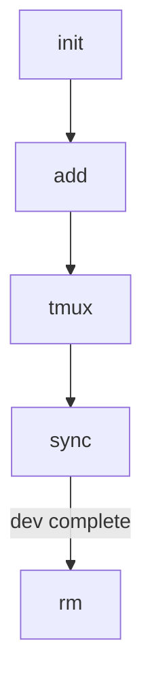

# Workflow

> このドキュメントは、`worktree-sync` が **npm パッケージ** として公開された際の、想定ユーザーフロー（CLI 操作）を示します。基本的なコマンドは `npx worktree-sync <subcommand>` 形式で実行できます。

---

## 0. 前提条件

| ツール | 推奨バージョン          |
| ------ | ----------------------- |
| git    | ≥ 2.33 (worktree+fixup) |
| node   | ≥ 18                    |
| direnv | ≥ 2.32                  |
| tmux   | ≥ 3                     |

---

## 1. インストール（グローバル or npx）

```bash
# 一度だけグローバルインストール
npm i -g worktree-sync
# もしくは都度 npx
npx worktree-sync --help
```

---

## 2. 初期化（既存リポジトリで 1 回）

```bash
cd ~/projects/repos/myrepo-main

# 設定ディレクトリを生成し、.envrc などを自動発行
npx worktree-sync init \
  --config-dir "$HOME/projects/configs" \
  --template node      # (任意) 設定テンプレート
```

生成されるもの

- `projects/configs/<repo>/.env` 初期ファイル
- `.envrc`（検索ロジック入り）
- `.git/hooks/post-checkout` など自動リンク

---

## 3. Worktree 作成

```bash
# feature ブランチ用の worktree を追加
npx worktree-sync add feature/login-ui
# => ~/projects/repos/myrepo-feature-login-ui/
```

オプション

- `--path ./custom-path` : 作成場所を指定
- `--copy` : symlink ではなくファイルコピーで設定を複製

---

## 4. tmux レイアウト起動

```bash
# 既存 worktree をスキャンして自動でセッションを構築
npx worktree-sync tmux
# - ウィンドウ: worktree ごと
# - ペイン: back/front などサブディレクトリ
```

tmux 上部ステータスバーにブランチ名 / DIR が表示されます。

---

## 5. 設定ファイルの同期

```bash
# configs ディレクトリ→全 worktree に反映
npx worktree-sync sync        # 双方向ではなく push 型

# 逆方向（worktree→configs へ取り込み）
npx worktree-sync collect
```

---

## 6. Worktree 削除 & クリーン

```bash
# 使い終わったら
npx worktree-sync rm feature/login-ui
# 残った空ディレクトリや symlink を掃除
npx worktree-sync clean
```

---

## 7. CI 連携例 (GitHub Actions)

```yaml
# .github/workflows/test.yml
- uses: actions/setup-node@v4
- run: npx worktree-sync ci-setup # .envrc をロードしてテスト実行
```

---

## 8. フルフロー図（概要）



以上が基本的な操作フローです。詳細オプションは `--help` を参照してください。
